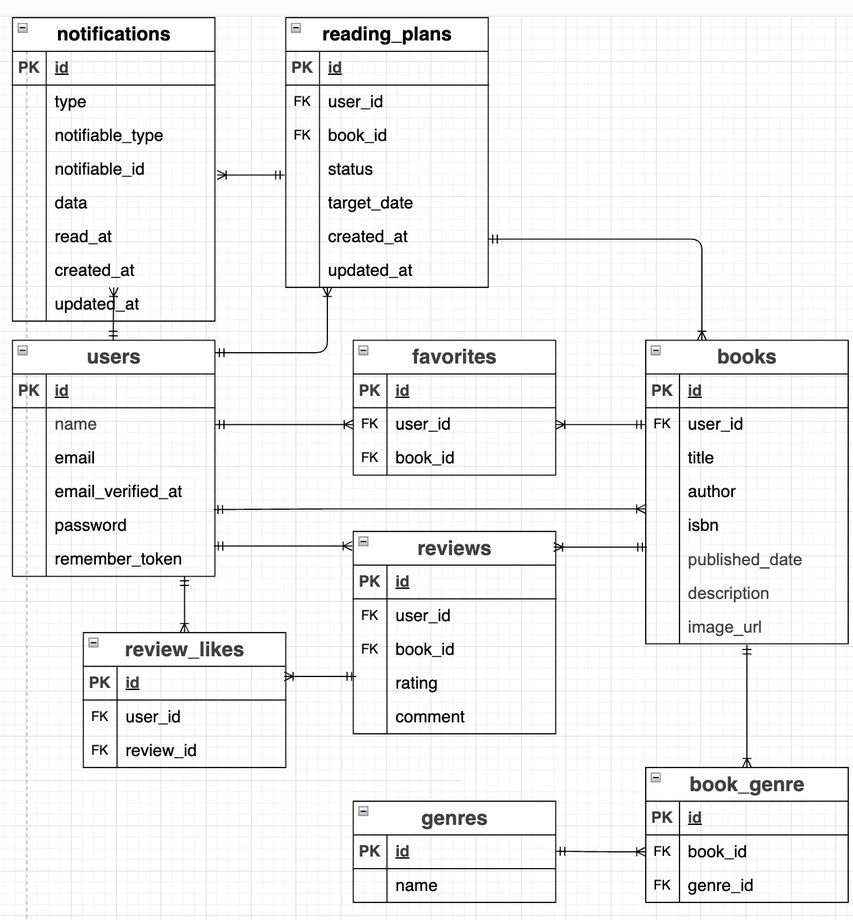

# BookShelf 書籍レビューアプリ

## 概要

書籍の登録・管理やレビュー投稿、お気に入り登録などができる書籍管理Webアプリです。

書籍情報の検索にはGoogle Books APIを使用し、読書計画の登録やリマインド通知などの機能も実装しています。

## 主な機能

* ユーザー登録・ログイン
* 書籍の登録・編集・削除
* 書籍検索
* ジャンル登録・検索
* レビュー投稿
* お気に入り登録
* いいね機能
* 書籍ランキング表示
* Google Books APIによる書籍検索
* 読書計画の登録・管理
* 読書計画のリマインド通知
* APIによる書籍情報の取得・登録・更新・削除

## ER図



## 環境構築

### 1. Laravelプロジェクト作成

Laravel 10.xを指定してプロジェクトを作成します。

```bash
docker run --rm -u "$(id -u):$(id -g)" -v "$(pwd):/var/www/html" -w /var/www/html -e COMPOSER_CACHE_DIR=/tmp/composer_cache laravelsail/php82-composer:latest composer create-project laravel/laravel:^10.0 bookshelf-app
```

### 2. Laravel Sailインストール

#### プロジェクトディレクトリに移動

```bash
cd bookshelf-app
```

#### Laravel Sailをインストール

```bash
docker run --rm -u "$(id -u):$(id -g)" -v "$(pwd):/var/www/html" -w /var/www/html -e COMPOSER_CACHE_DIR=/tmp/composer_cache laravelsail/php82-composer:latest composer require laravel/sail --dev
```

#### Sailの設定をパブリッシュ（MySQLを選択）

```bash
docker run --rm -u "$(id -u):$(id -g)" -v "$(pwd):/var/www/html" -w /var/www/html -e COMPOSER_CACHE_DIR=/tmp/composer_cache laravelsail/php82-composer:latest php artisan sail:install --with=mysql
```

Apple Silicon（M1/M2/M3）環境で`no matching manifest for linux/arm64/v8`が発生する場合は、`compose.yaml`のMySQLサービスに以下を追加します。

```yaml
platform: 'linux/amd64'
```

### 3. `.env`ファイルの環境変数設定

データベースに接続するため、`.env`のデータベース設定を以下のようにします。

```env
DB_CONNECTION=mysql
DB_HOST=mysql
DB_PORT=3306
DB_DATABASE=laravel
DB_USERNAME=sail
DB_PASSWORD=password
```

### 4. フロントエンド環境構築

#### npmパッケージをインストール

```bash
sail npm install
```

#### Alpine.jsをインストール

```bash
sail npm install alpinejs
```

#### Tailwind CSS関連パッケージをインストール

```bash
sail npm install -D tailwindcss@^3.4.0 @tailwindcss/forms postcss autoprefixer
```

#### Tailwind CSSの設定ファイルを作成

```bash
sail npx tailwindcss init -p
```

#### `tailwind.config.js`を設定

```javascript
import defaultTheme from 'tailwindcss/defaultTheme';
import forms from '@tailwindcss/forms';

/** @type {import('tailwindcss').Config} */
export default {
    content: [
        './vendor/laravel/framework/src/Illuminate/Pagination/resources/views/*.blade.php',
        './storage/framework/views/*.php',
        './resources/views/**/*.blade.php',
    ],
    theme: {
        extend: {
            fontFamily: {
                sans: ['Figtree', ...defaultTheme.fontFamily.sans],
            },
        },
    },
    plugins: [forms],
};
```

#### Basic版のBladeファイルを配置

基本機能用のBladeファイルを`resources`ディレクトリに配置します。

#### 開発サーバーを起動

```bash
sail npm run dev
```

### 5. phpMyAdmin導入

`compose.yaml`のMySQLサービスの下に、phpMyAdminの設定を追加します。

```yaml
phpmyadmin:
    image: 'phpmyadmin:latest'
    ports:
        - '${FORWARD_PHPMYADMIN_PORT:-8080}:80'
    environment:
        PMA_HOST: mysql
        PMA_USER: '${DB_USERNAME}'
        PMA_PASSWORD: '${DB_PASSWORD}'
    networks:
        - sail
    depends_on:
        - mysql
```

### 6. Laravel Sail起動・alias設定

#### Laravel Sailを起動

```bash
./vendor/bin/sail up -d
```

#### `sail`コマンドを簡略化するためaliasを設定

`~/.zshrc`に以下を追加します。

```bash
echo "alias sail='[ -f sail ] && bash sail || bash vendor/bin/sail'" >> ~/.zshrc
```

#### シェルを再読み込み

```bash
exec $SHELL
```

### 7. アプリケーションキー生成

Laravelで使用するアプリケーションキーを生成します。

```bash
sail artisan key:generate
```

### 8. データベース設定

#### マイグレーション・シーダーを実行

データベースのテーブルを作成し、初期データを登録します。

```bash
sail artisan migrate --seed
```

データベースを初期化して再構築する場合は、以下を使用します。

```bash
sail artisan migrate:fresh --seed
```

### 9. 日本語設定

`config/app.php`のlocaleを`ja`に設定します。

また、日本語の言語ファイルを配置します。

### 10. Advanced版Bladeファイル・データモデル設定

基本機能の実装完了後、応用機能の画面に対応するBladeテンプレートを配置し、データモデルを応用版へ拡張します。

#### Bladeテンプレートの差し替え

`coachtech-prepared-file/Preparedblade-mockcase-BookShelf`リポジトリの`Advanced`ブランチから`resources`ファイルを再度取得し、プロジェクトの`resources`ディレクトリを置き換えます。

#### 応用版データモデル変更の適用

応用機能で使用するデータモデルに合わせてマイグレーションを変更し、データベースを再構築します。

```bash
sail artisan migrate:fresh --seed
```

マイグレーションの変更内容については、設計書のシート11・12を参照してください。


### 11. Google Books API設定

Google CloudでBooks APIを有効化し、APIキーを取得します。

#### `.env`にAPIキーを設定

```env
GOOGLE_BOOKS_API_KEY=取得したAPIキー
```

## API認証

Laravel Sanctumを使用してAPI認証を行っています。

| エンドポイント                       | 認証 |
| ----------------------------- | -- |
| GET `/api/v1/books`           | 不要 |
| GET `/api/v1/books/{book}`    | 不要 |
| POST `/api/v1/books`          | 必要 |
| PUT `/api/v1/books/{book}`    | 必要 |
| DELETE `/api/v1/books/{book}` | 必要 |

`PUT`・`DELETE`は、ログインユーザー自身が登録した書籍のみ操作できます。

## APIエンドポイント一覧

| Method | URL                    | 内容     |
| ------ | ---------------------- | ------ |
| GET    | `/api/v1/books`        | 書籍一覧取得 |
| GET    | `/api/v1/books/{book}` | 書籍詳細取得 |
| POST   | `/api/v1/books`        | 書籍登録   |
| PUT    | `/api/v1/books/{book}` | 書籍更新   |
| DELETE | `/api/v1/books/{book}` | 書籍削除   |

## APIエラー

### 401 未認証

```json
{
    "error": "認証が必要です。"
}
```

### 403 権限なし

```json
{
    "error": "この操作を実行する権限がありません。"
}
```

### 404 書籍が見つからない場合

```json
{
    "error": "書籍が見つかりませんでした。"
}
```

### 422 バリデーションエラー

```json
{
    "message": "laravel標準のバリデーションエラーメッセージ",
    "errors": {
        "title": [
            "タイトルは必須です。"
        ],
        "author": [
            "著者は255文字以内で入力してください。"
        ]
    }
}
```

## 定期実行

読書計画のリマインド処理を、macOSのcronとLaravel Schedulerを使用して毎日20:00に実行します。

### cronの設定

#### crontabを編集

```bash
crontab -e
```

#### 毎分Laravel Schedulerを実行

以下を追加します。

```cron
* * * * * cd /プロジェクトのパス/bookshelf-app && ./vendor/bin/sail artisan schedule:run >> /tmp/bookshelf-scheduler.log 2>&1
```

cronでは毎分Laravel Schedulerを実行し、Laravel Scheduler側で毎日20:00にリマインド処理を実行します。

### Laravel Schedulerの設定

`routes/console.php`で、`reading-plans:remind`を毎日20:00に実行するよう設定しています。

```php
Schedule::command('reading-plans:remind')->dailyAt('20:00');
```

設定内容を確認する場合：

```bash
crontab -l
```

Laravel Schedulerの設定を確認する場合：

```bash
sail artisan schedule:list
```

`0 20 * * *`と表示されれば、毎日20:00に実行される設定です。

cronによる処理を実行するには、Dockerコンテナが起動している必要があります。

## 使用技術

| 技術               | 内容           |
| ---------------- | ------------ |
| PHP              | 8.5          |
| Laravel          | 10.x         |
| MySQL            | 8.4          |
| Docker           | Laravel Sail |
| Tailwind CSS     | CSSフレームワーク   |
| Alpine.js        | JavaScript   |
| Laravel Sanctum  | API認証        |
| Google Books API | 書籍情報取得       |
| phpMyAdmin       | データベース管理     |
| Git / GitHub     | バージョン管理      |

## 開発環境URL

### アプリケーション

http://localhost

### phpMyAdmin

http://localhost:8080

## テスト

以下のコマンドでテストを実行できます。

```bash
sail artisan test
```

全テストが通過することを確認しています。

## コード品質

Laravel Pintを使用してコードフォーマットを実施しています。

```bash
sail pint
```

## 作成者

大石大樹
